## 1.2. Understanding how it works

Penjelasan: Alasan mengapa teks "hey hey" muncul pertama kali adalah karena blok spawner.spawn hanya mengirimkan task ke dalam queue channel, tetapi tidak langsung menjalankannya saat itu juga. Sementara itu, program utama (thread utama) terus berjalan mengeksekusi kode sinkronus secara berurutan, sehingga baris println!("... hey hey") dieksekusi terlebih dahulu. Eksekusi tugas asinkronus ("howdy!" dan "done!") baru benar-benar dijalankan setelah program mencapai baris executor.run(), di mana executor mulai mengambil tugas dari antrean dan menjalankannya satu per satu.

## 1.3. Multiple Spawn and removing drop

### 1. Multiple spawn dengan `drop(spawner)` di-comment
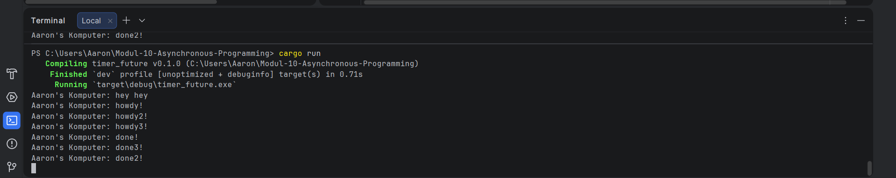

Penjelasan:
Pada screenshot ini, sangat jelas terlihat bahwa setelah mencetak `done2!`, program tidak berhenti dan kursor terminal tampak menggantung (tidak mengembalikan prompt `PS C:\...`). Hal ini membuktikan bahwa program mengalami blocking. Executor masih terjebak di dalam loop menunggu tugas baru yang tidak akan pernah datang karena Spawnernya belum di-drop (ditutup), sehingga Executor mengira masih akan ada pengiriman tugas.

### 2. Multiple spawn dengan `drop(spawner)` di-uncomment
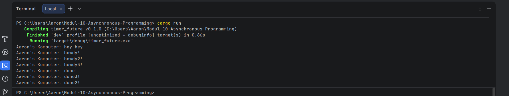

Penjelasan:
Pada screenshot ini, terlihat program berhasil selesai dengan normal. Setelah semua tugas selesai dieksekusi dan teks `done` tercetak, program langsung keluar dan mengembalikan prompt `PS C:\...`. Ini membuktikan bahwa pemanggilan `drop(spawner)` berhasil memberi tahu Executor bahwa tidak ada lagi tugas yang akan dikirim, sehingga loop `recv()` pada Executor bisa dihentikan.

Catatan tambahan: Terlihat juga bahwa urutan teks `done` yang tercetak tidak selalu berurutan (misal: `done!`, `done3!`, `done2!`). Ini menunjukkan sifat concurrent dari program, di mana tugas-tugas dijalankan secara bersamaan dan diselesaikan berdasarkan siapa yang selesai melakukan delay lebih dulu, bukan berdasarkan urutan spawn.

### Q&A

What is the spawner for? Spawner bertugas untuk membuat tugas baru (futures) dan mengirimkannya ke dalam queue channel agar nantinya bisa diambil oleh Executor.

What is the executor for? Executor bertugas mengambil tugas-tugas dari antrean channel tersebut dan menjalankannya (melakukan poll) hingga tugas tersebut benar-benar selesai secara keseluruhan.

What is the drop for? `drop(spawner)` berfungsi untuk menutup channel pengiriman. Ini memberikan sinyal kepada Executor bahwa tidak akan ada lagi tugas baru yang dikirim ke dalam antrean.

Kenapa program hang saat drop dihapus? Karena Executor (pada baris `while let Ok(task) = self.ready_queue.recv()`) akan terus menunggu di dalam loop untuk mengambil tugas baru. Jika spawner tidak di-drop, channel tidak tertutup. Akibatnya, eksekutor akan mengira masih ada tugas yang akan datang dan terus menunggu selamanya (blocking).

## 2.1. Original code of broadcast chat

Hasil Pengujian:
(Berikut adalah screenshot dari 3 terminal client yang sedang saling berbalas pesan)

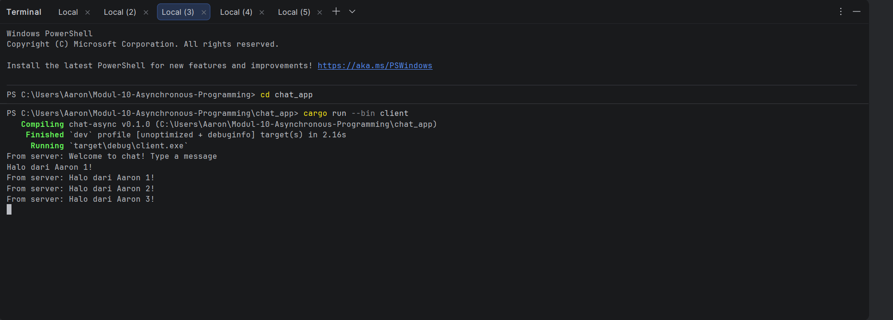
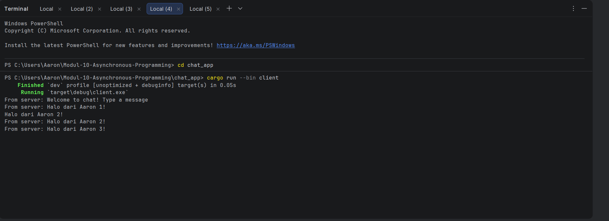
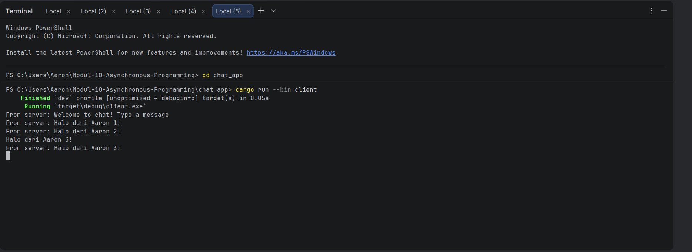

**How to run it:**
1. Membuka beberapa terminal secara terpisah (4 terminal).
2. Memastikan setiap terminal sudah berada di direktori project `chat_app`.
3. Menjalankan satu server pada satu terminal dengan perintah `cargo run --bin server`.
4. Menjalankan tiga client pada tiga terminal lainnya menggunakan perintah `cargo run --bin client`.

**What happens when you type some text in the clients?**
Ketika saya mengetik teks di salah satu client dan menekan Enter, teks tersebut dikirimkan ke server. Server yang berjalan secara asinkronus (menggunakan protokol WebSocket) langsung menerima pesan tersebut dan membroadcast/meneruskan pesan itu ke semua client lain yang sedang terhubung ke server secara real-time. Itulah mengapa pesan dari satu terminal client bisa langsung muncul di layar terminal client lainnya tanpa perlu merefresh.

## 2.2. Modifying the websocket port

Penjelasan Modifikasi Port:
Untuk mengubah port menjadi 8080, saya harus memodifikasi dua file karena komunikasi WebSocket melibatkan dua sisi yang harus menyepakati port yang sama:

1. `src/bin/client.rs`: Mengubah string URI dari `"ws://127.0.0.1:2000"` menjadi `"ws://127.0.0.1:8080"`.
2. `src/bin/server.rs`: Mengubah alamat binding TCP dari `"127.0.0.1:2000"` menjadi `"127.0.0.1:8080"`. Dan juga jangan lupa ubah println nya menjadi println!("listening on port 8080");

**Apakah keduanya menggunakan protokol websocket yang sama? Dan di mana itu didefinisikan?**
Ya, keduanya menggunakan protokol WebSocket yang sama.
Pada sisi client, protokol ini secara eksplisit didefinisikan lewat scheme `ws://` di dalam URI (`Uri::from_static("ws://127.0.0.1:8080")`).
Pada sisi server, meskipun awalnya hanya membuka koneksi TCP standar lewat `TcpListener::bind`, protokol tersebut di-upgrade menjadi WebSocket oleh fungsi `accept_async(stream).await` dari library `tokio_websockets`.

## 2.3. Small changes. Add some information to client

Hasil Pengujian:
*(Terminal Server)*
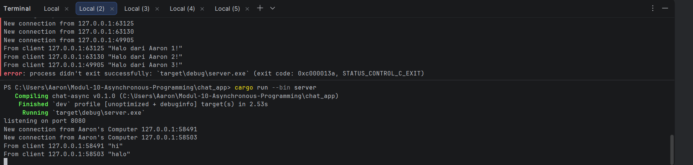

*(Terminal Client)*
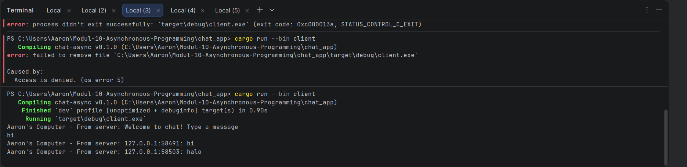
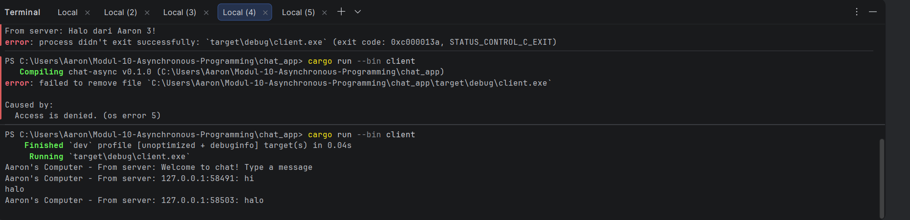

**Penjelasan Modifikasi:**
Untuk menambahkan informasi IP dan Port pengirim (`addr`), modifikasi utama dilakukan di file `server.rs` pada bagian `bcast_tx.send()`. Alasannya karena server adalah pusat/titik kumpul dari semua koneksi. Server yang memiliki informasi alamat dari setiap client yang terhubung. Dengan memodifikasi pesannya di sisi server (`format!("{addr}: {text}")`) sebelum di-broadcast, kita memastikan bahwa seluruh client yang menerima pesan tersebut otomatis mendapatkan informasi identitas pengirimnya tanpa perlu client tersebut mencari tahu sendiri. Sementara itu, untuk penambahan nama "Aaron's Computer", dilakukan di `client.rs` (untuk formatting tampilan lokal) dan di `server.rs` pada pesan New connection agar memudahkan pelacakan log di terminal server.

## 3.1. Original code

**Hasil Pengujian WebChat:**

*(Simulasi Client pada Web Browser)*
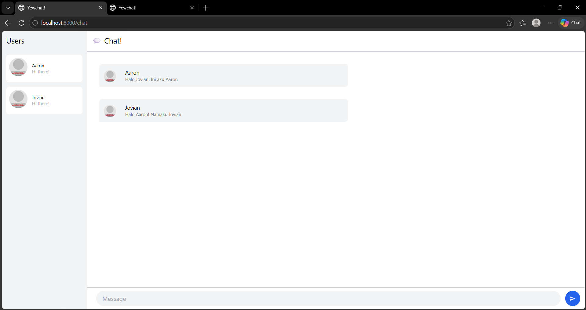

*(Terminal SimpleWebsocketServer)*
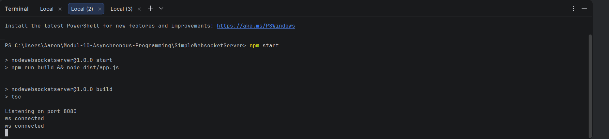

*(Terminal YewChat Client)*
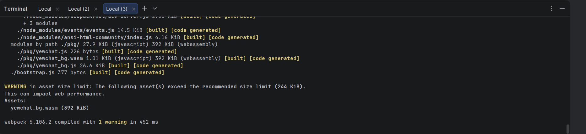

**Penjelasan:**
Saya telah berhasil melakukan clone pada source code client (YewChat) dan server (SimpleWebsocketServer). Setelah melakukan beberapa penyesuaian dependency pada Webpack dan wasm-bindgen, WebChat dapat terbuka melalui browser di `localhost:8000`. Saya membuka dua jendela browser sebagai simulasi dua client yang berbeda. Ketika saya mengetik pesan di salah satu jendela, pesan tersebut berhasil di-broadcast dan muncul secara real-time di jendela browser lainnya menggunakan protokol WebSocket.

## 3.2. Add some creativities to the webclient

**Tampilan WebChat setelah Modifikasi:**

*(Halaman Login yang Telah Dimodifikasi)*
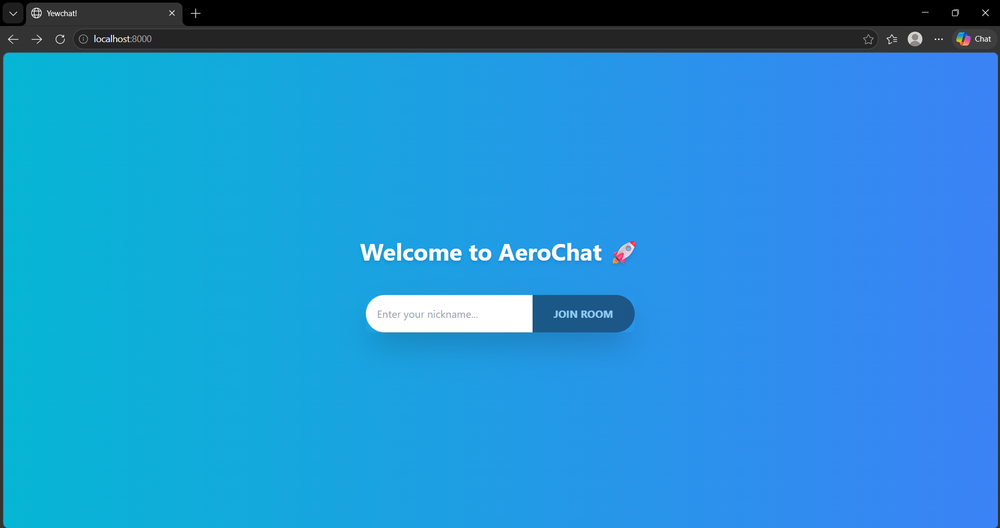

*(Halaman Chat yang Telah Dimodifikasi)*
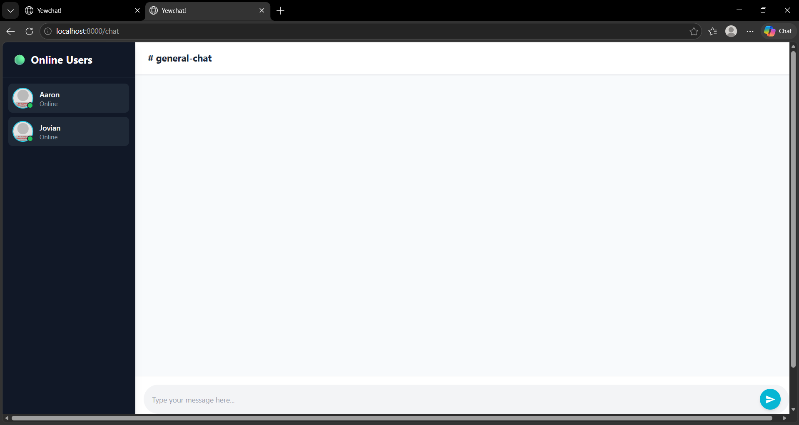

**Penjelasan Modifikasi:**
Pada eksperimen ini, saya menambahkan beberapa kreativitas untuk mempercantik tampilan frontend YewChat dengan memodifikasi class Tailwind CSS di dalam macro `html!` pada file `login.rs` dan `chat.rs`. Berikut adalah detail perubahannya:

1. **Halaman Login (`login.rs`):**
    * Mengubah latar belakang polos menjadi gradasi biru (`bg-gradient-to-r from-cyan-500 to-blue-500`).
    * Menambahkan judul "Welcome to AeroChat 🚀" dengan efek drop-shadow.
    * Memberikan efek lengkungan penuh (`rounded-full`) pada input teks dan tombol, serta menambahkan efek interaktif (`hover`) pada tombol "Join Room".

2. **Halaman Chat (`chat.rs`):**
    * Mengubah tema sidebar menjadi gelap (dark mode) dengan memberikan indikator status "Online" yang lebih menonjol (lingkaran hijau).
    * Membersihkan area obrolan utama dengan warna latar belakang yang lebih netral (`bg-slate-50`) dan memberikan padding yang lebih nyaman dipandang.
    * Merombak kotak pesan (chat bubble) dengan sudut asimetris (`rounded-r-2xl rounded-bl-2xl`) agar memberikan kesan percakapan yang modern.
    * Memperbarui area input obrolan agar terlihat lebih menyatu dengan tombol kirim (send button).

