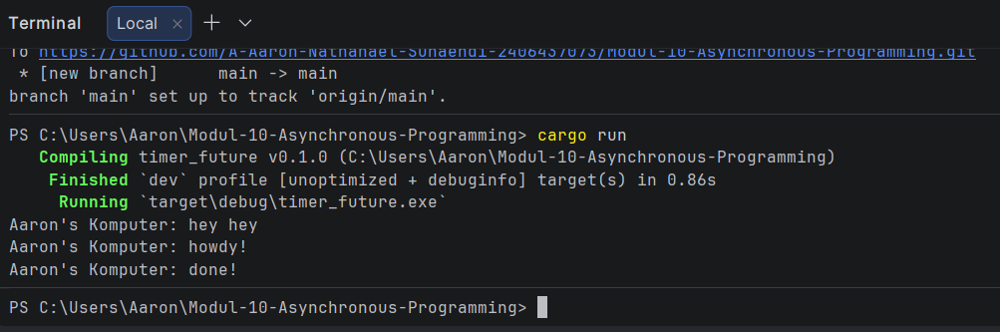

## 1.2. Understanding how it works

Penjelasan: Alasan mengapa teks "hey hey" muncul pertama kali adalah karena blok spawner.spawn hanya mengirimkan task ke dalam queue channel, tetapi tidak langsung menjalankannya saat itu juga. Sementara itu, program utama (thread utama) terus berjalan mengeksekusi kode sinkronus secara berurutan, sehingga baris println!("... hey hey") dieksekusi terlebih dahulu. Eksekusi tugas asinkronus ("howdy!" dan "done!") baru benar-benar dijalankan setelah program mencapai baris executor.run(), di mana executor mulai mengambil tugas dari antrean dan menjalankannya satu per satu.

